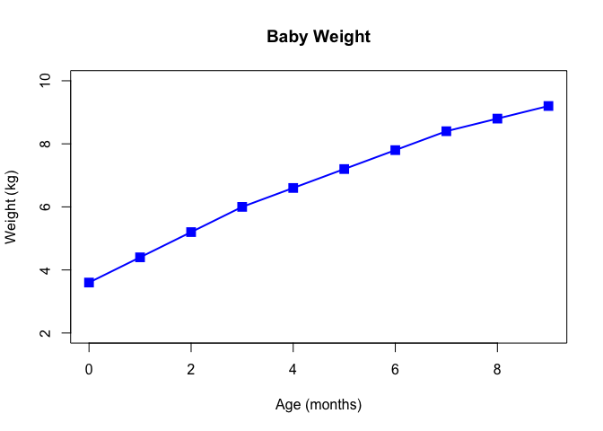
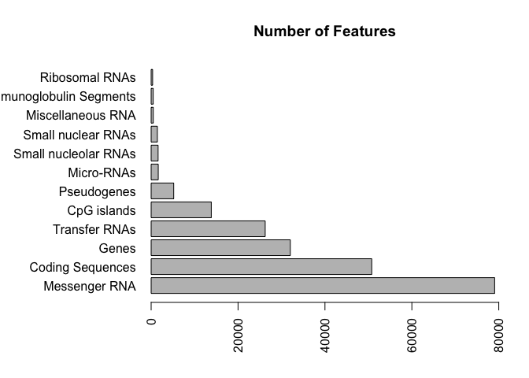
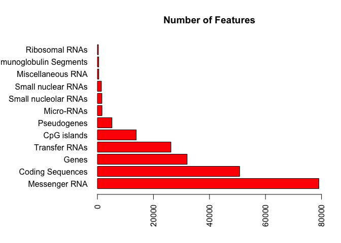
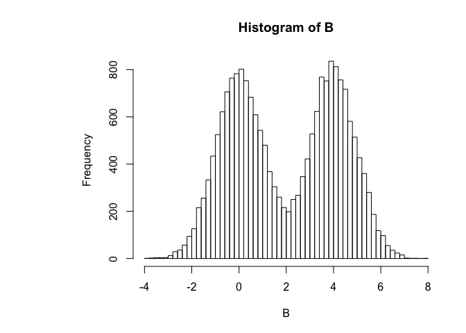
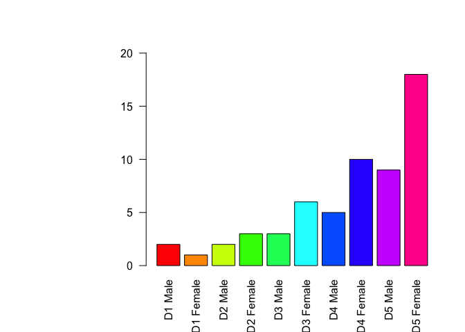
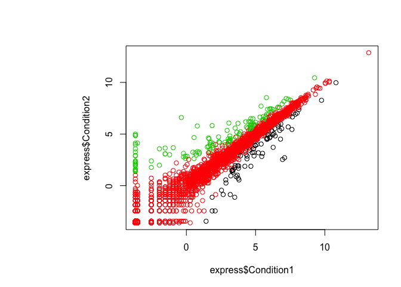
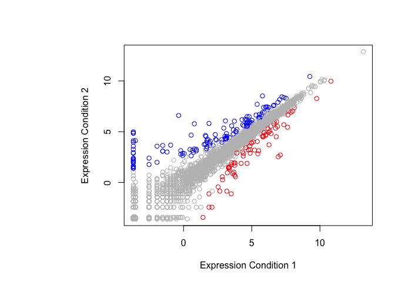

Crop Analysis Q3 2013
================
Danielle Garshott
Jan 23rd, 2019

Class 05 Graphics and plots with R This is some narative text that I can style **bold** and *italic* and add links to \[webpages\]

``` r
# Section 2A: line plot 

weight <- read.table("bimm143_05_rstats/weight_chart.txt", header = TRUE)
plot(weight, pch = 15, cex = 1.5, type = "o", col = "blue", lwd = 2, ylim = c(2,10), xlab = "Age (months)", ylab = "Weight (kg)", main = "Baby Weight")
```



``` r
# Section 2B: bar plots
# \t encodes a tab character 
# mar (first-up, second-right, third-down, fourth-left)
counts <- read.table("bimm143_05_rstats/feature_counts.txt", header = TRUE, sep = "\t")
par(mar=c(5,10,4,2))
barplot(counts$Count, horiz=TRUE, names.arg = counts$Feature, las=2, main="Number of Features", xlim= c(0,80000))
```



``` r
par(mar=c(5,10,4,2))
barplot(counts$Count, horiz=TRUE, names.arg = counts$Feature, las=2, main="Number of Features", xlim= c(0,80000), col = "RED")
```



``` r
# Section 2C: Histograms

B <- c(rnorm(10000), rnorm(10000)+4)
hist(B, breaks=80)
```



``` r
# Section 3A: Proving color vectors

mf <- read.table("bimm143_05_rstats/male_female_counts.txt", header=TRUE, sep="\t")
mfc <- read.delim("bimm143_05_rstats/male_female_counts.txt")
par(mar=c(5,11,4,2))
barplot(mf$Count, names.arg = mf$Sample, ylim = c(0,20), las=2, col = rainbow(nrow(mf)))
```



``` r
# Section 3B: Coloring by value


express <- read.delim("bimm143_05_rstats/up_down_expression.txt", header = TRUE)
# how many genes
nrow(express)
```

    ## [1] 5196

``` r
table(express$State)
```

    ## 
    ##       down unchanging         up 
    ##         72       4997        127

``` r
plot(express$Condition1, express$Condition2, col=express$State)
```



``` r
palette()
```

    ## [1] "black"   "red"     "green3"  "blue"    "cyan"    "magenta" "yellow" 
    ## [8] "gray"

``` r
levels(express$State)
```

    ## [1] "down"       "unchanging" "up"

``` r
palette(c("red", "gray", "blue"))
plot(express$Condition1, express$Condition2, col=express$State, xlab = "Expression Condition 1", ylab = "Expression Condition 2")
```



``` r
# Section 3C: Dynamic use of color 
```
