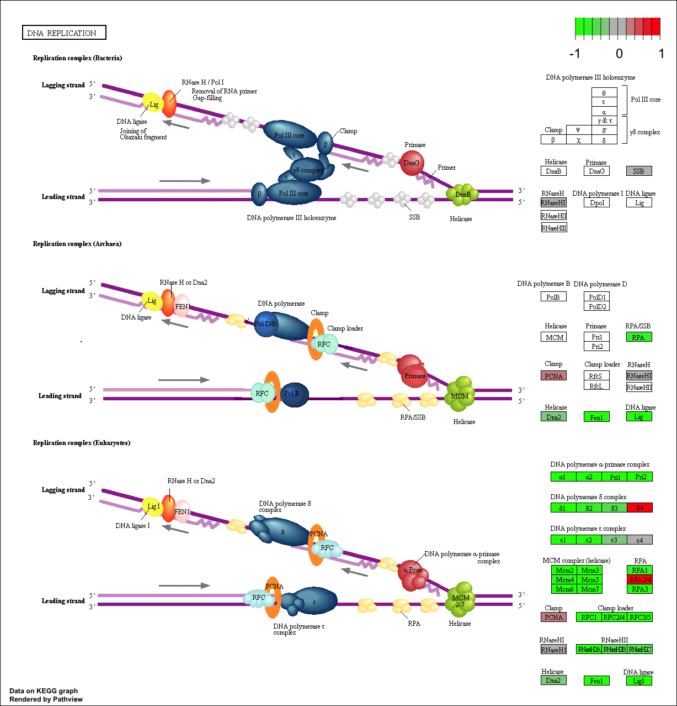

```{r setup, include=FALSE}
knitr::opts_chunk$set(echo = TRUE)
```

## Differential Expression Analysis 

```{r}
library(DESeq2)

```

```{r}
metaFile <- "Analysis/GSE37704_metadata.csv"
countFile <- "Analysis/GSE37704_featurecounts.csv"

# Import metadata and take a peak
colData = read.csv(metaFile, row.names=1)
head(colData)
```

```{r}
# Import countdata
countData = read.csv(countFile, row.names=1)
head(countData)
```

```{r}
ncol(countData)
nrow(countData)
# dim function gives you both row and column
dim(countData)
```

> Q. Complete the code below to remove the troublesome first column from countData

```{r}
# Note we need to remove the odd first $length col
# -1 removes the first column
countData <- as.matrix(countData[,-1])
head(countData)
```

```{r}
rownames(colData)
colnames(countData)
```

How many genes do we have left?
```{r}
head(countData)
```

```{r}
inds <- rowSums(countData) != 0
countData = countData[inds,]
head(countData)
```

```{r}
nrow(countData)
```

We now have `r nrow(countData)` genes remaining in our dataset 

## Run DESeq2
```{r}
dds <-  DESeqDataSetFromMatrix(countData=countData,
                             colData=colData,
                             design=~condition)
dds <-  DESeq(dds)
```


```{r}
res <- results(dds)
head(res)
```

## Volcano plots

```{r}
plot(res$log2FoldChange, -log(res$padj))
```

> Q. Improve this plot by completing the below code, which adds color and axis labels

```{r}
# Make a color vector for all genes: nrow(res) is arguing for gray for the number of genes we have.
mycols <- rep("gray", nrow(res) )

# Color red the genes with absolute fold change above 2
mycols[ abs(res$log2FoldChange) > 2 ] <- "red"

# Color blue those with adjusted p-value less than 0.01
#  and absolute fold change more than 2
inds <- (res$padj < 0.01) & (abs(res$log2FoldChange) > 2 )
mycols[ inds ] <- "blue"

plot( res$log2FoldChange, -log(res$padj), col= mycols, xlab="Log2(FoldChange)", ylab="-Log(P-value)" )

```

> Q. Use the mapIDs() function multiple times to add SYMBOL, ENTREZID and GENENAME annotation to our results by completing the code below.

```{r}

#write.csv(res, file="deseq_results.csv")
library("AnnotationDbi")
library("org.Hs.eg.db")

columns(org.Hs.eg.db)

head(res, 10)
```


```{r}

# key: what kind of key (i.e. gene names: ENSEMBL)

res$symbol = mapIds(org.Hs.eg.db,
                    keys=row.names(res), 
                    keytype="ENSEMBL",
                    column="SYMBOL",
                    multiVals="first")

res$entrez = mapIds(org.Hs.eg.db,
                    keys=row.names(res),
                    keytype="ENSEMBL",
                    column="ENTREZID",
                    multiVals="first")

res$name =   mapIds(org.Hs.eg.db,
                    keys=row.names(res),
                    keytype="ENSEMBL",
                    column="GENENAME",
                    multiVals="first")

head(res,10)
```

>Q. Finally for this section let’s reorder these results by adjusted p-value and save them to a CSV file in your current project directory.

```{r}
res = res[order(res$pvalue),]
write.csv(res, file = "deseq_results.csv")
```


## KEGG pathways

```{r}
library(pathview)
```

```{r}
library(gage)
library(gageData)

data(kegg.sets.hs)
data(sigmet.idx.hs)

# Focus on signaling and metabolic pathways only
kegg.sets.hs =  kegg.sets.hs[sigmet.idx.hs]

# Examine the first 3 pathways
head(kegg.sets.hs, 3)
```

Setup my input for **gage()**

```{r}
foldchanges = res$log2FoldChange
names(foldchanges) = res$entrez
head(foldchanges)
```

```{r}
# Get the results
keggres = gage(foldchanges, gsets=kegg.sets.hs)
```


```{r}
attributes(keggres)
```


```{r}
# Look at the first few down (less) pathways
head(keggres$less)
```

```{r}
pathview(gene.data=foldchanges, pathway.id="hsa04110")
```

If I was using regular text and wanted a [link]()
If I want to clip an image into the document


```{r}
# Note: {chunk = TRUE} when you knit the document it will not run the code, just grab the answer. Saves sometime.
pathview(gene.data=foldchanges, pathway.id="hsa03013")
```


```{r}
pathview(gene.data=foldchanges, pathway.id="hsa03030")
```




## Gene Ontology (GO)
```{r}
data(go.sets.hs)
data(go.subs.hs)

# Focus on Biological Process subset of GO
gobpsets = go.sets.hs[go.subs.hs$BP]

gobpres = gage(foldchanges, gsets=gobpsets, same.dir=TRUE)

lapply(gobpres, head)
```


